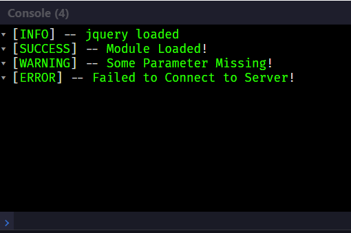

# Debug-Info-Snippet
A simple Js based debug-info-snippet for displaying information on console

## Usage
Just a function call!

`dbg(LogInfo, "Message")`

Here **LogInfo** is used to display the type of log information(INFO, SUCCESS, etc.). And **Message** is the string/message we need to display!

## Various LogInfo
Currently there are *Info*, *Success*, *Warning* and *Error* LogInfos implemented, feel free to add your own.

|**LogInfo**|**String**|**Number**|
|---|---|---|
|*Information*|"i"|1|
|---|---|---|
|*Success*|"s"|2|
|---|---|---|
|*Warning*|"w"|3|
|---|---|---|
|*Error*|"e"|4|
|---|---|---|

## Sample Code

`dbg("s", "Project directory updated!");`

`dbg(2, "Project directory updated!");`
